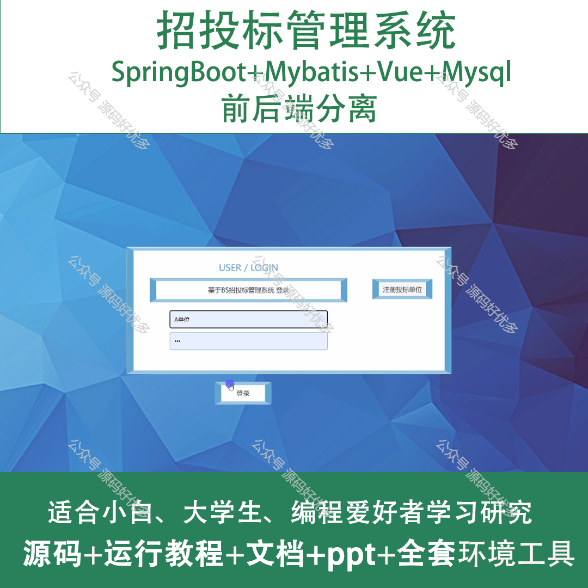
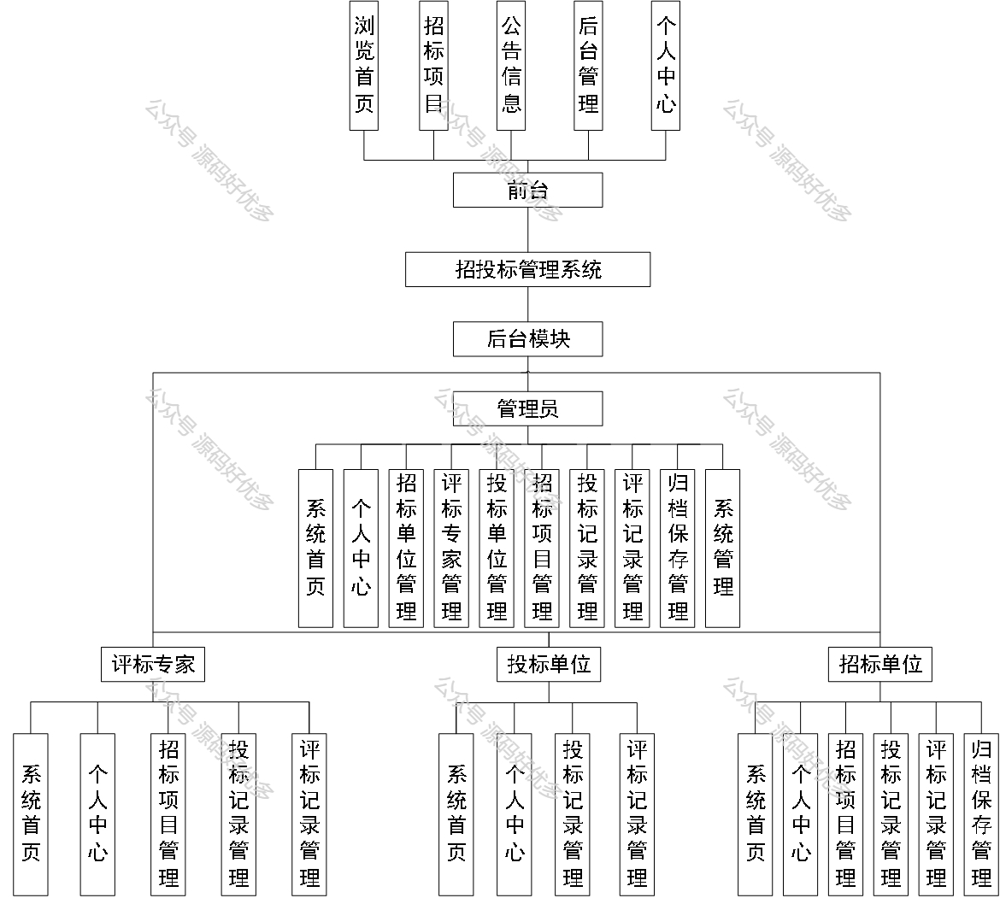
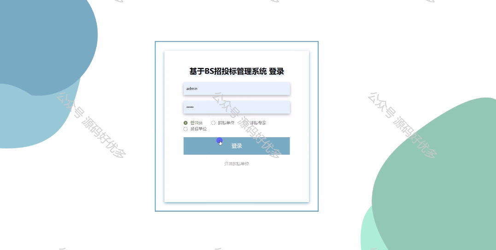
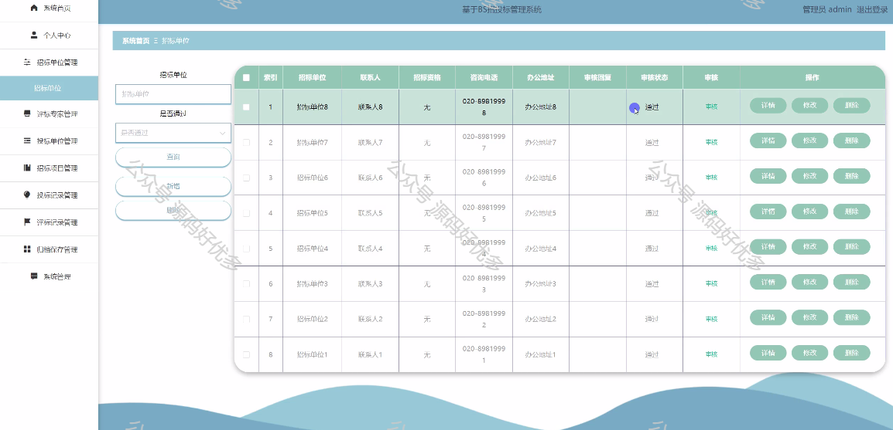
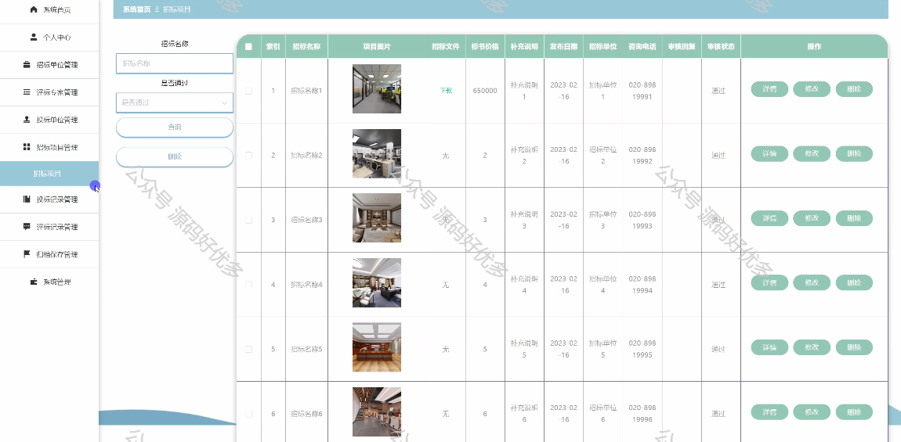
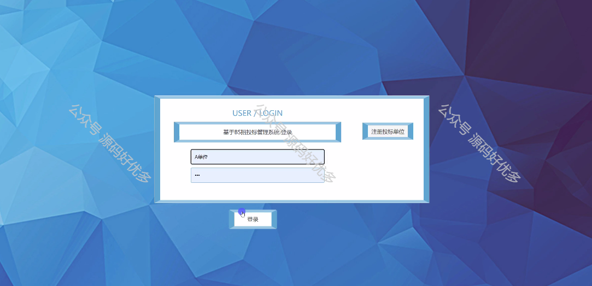
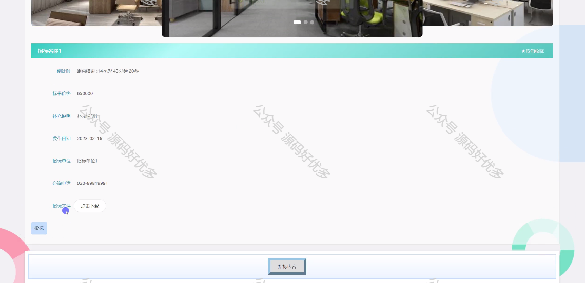
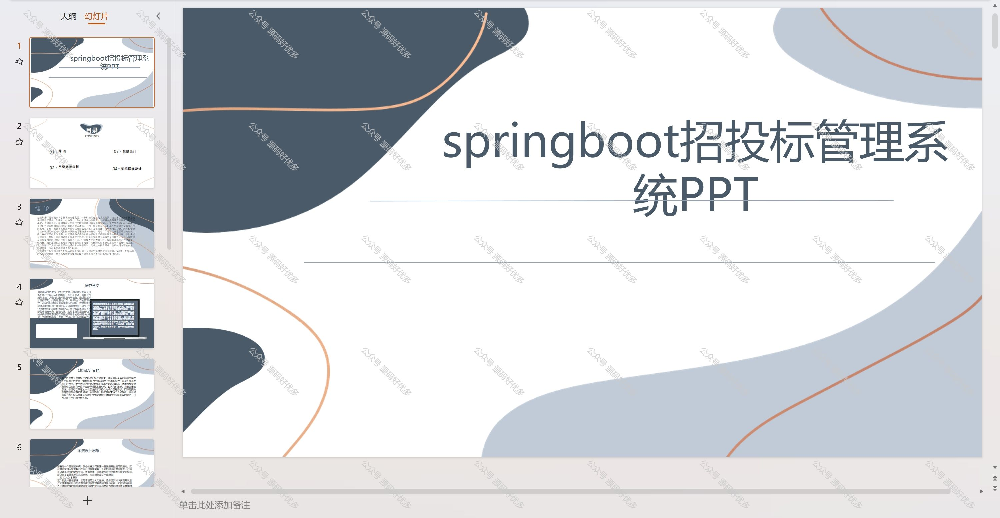
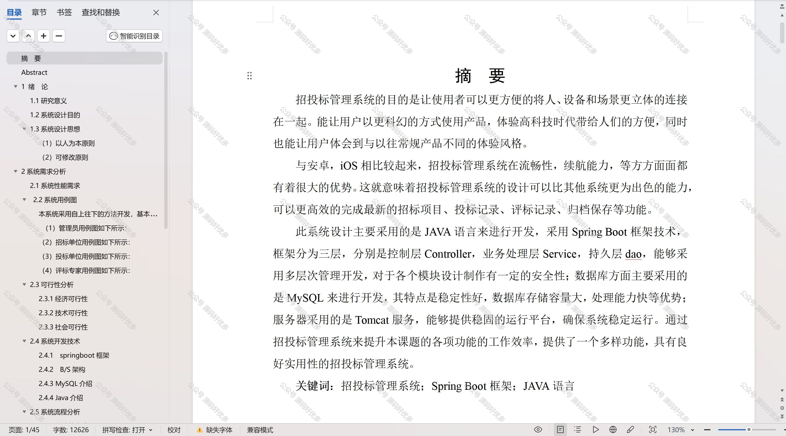

 
## 查看主页获取源码

### 一、作品包含

源码+数据库+设计文档万字+PPT+全套环境和工具资源+部署教程

### 二、项目技术

前端技术：Html、Css、Js、Vue、Element-ui

数据库：MySQL

后端技术：Java、Spring Boot、MyBatis

  

### 三、运行环境

开发工具：IDEA/eclipse

数据库：MySQL5.7

数据库管理工具：Navicat10以上版本

环境配置软件： JDK1.8+Maven3.6.3

前端Nodejs：14

### 四、项目介绍
项目编号：springbootA209

招投标管理系统是现代企业提高采购效率和透明度的重要工具，它通过电子化手段，为招标方和投标方提供了一个公平、公正、公开的竞争平台。该系统不仅能够规范招投标流程，确保信息的安全性和准确性，还能有效降低交易成本，提高资源配置效率，从而在促进市场有序竞争的同时，也为企业挖掘更多优质供应商提供了便利。

前台用户功能：浏览首页、招标项目、公告信息、后台管理、个人中心。

后台分为管理员、评标专家、投标单位、招标单位
管理员的功能：系统首页、个人中心、招标单位管理、评标专家管理、投标单位管理、招标项目管理、投标记录管理、评标记录管理、归档保存管理以及系统管理。
评标专家的功能：系统首页、个人中心、招标项目管理、投标记录管理、评标记录管理。
投标单位的功能：系统首页、个人中心、投标记录管理、评标记录管理。
招标单位的功能：系统首页、个人中心、招标项目管理、投标记录管理、评标记录管理和归档保存管理。

### 五、运行截图

  

